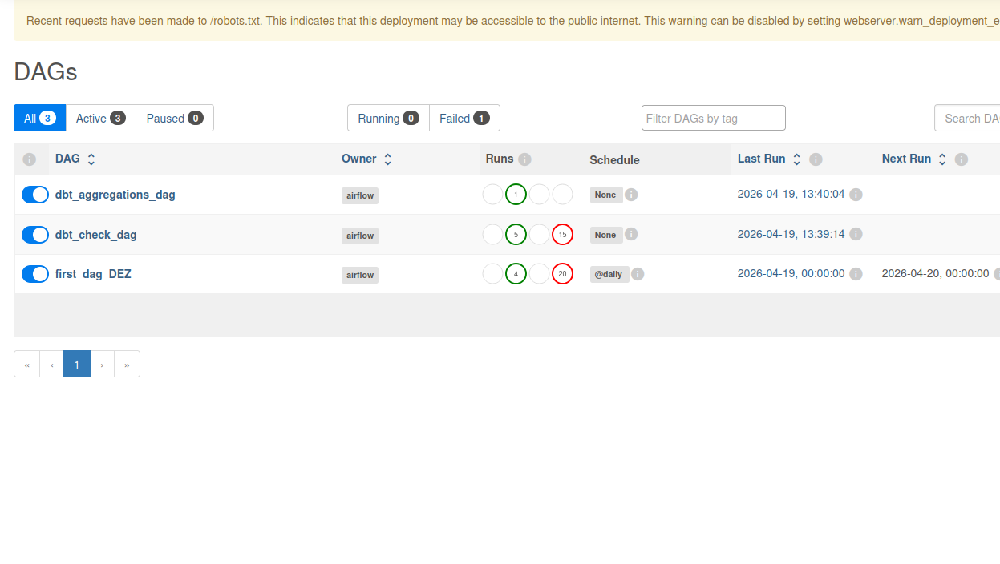
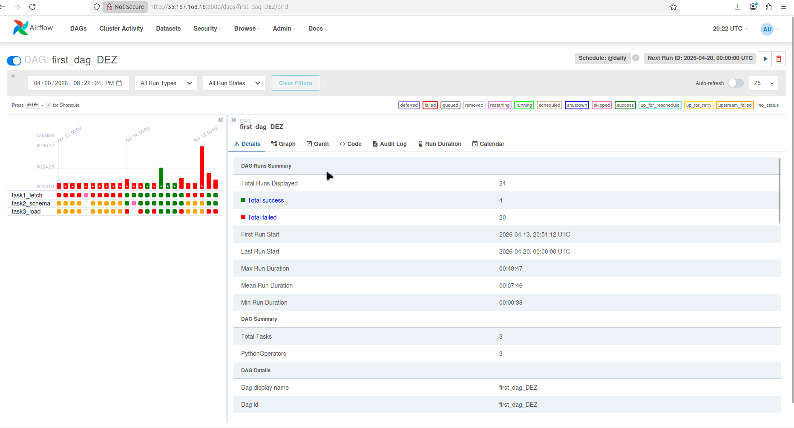
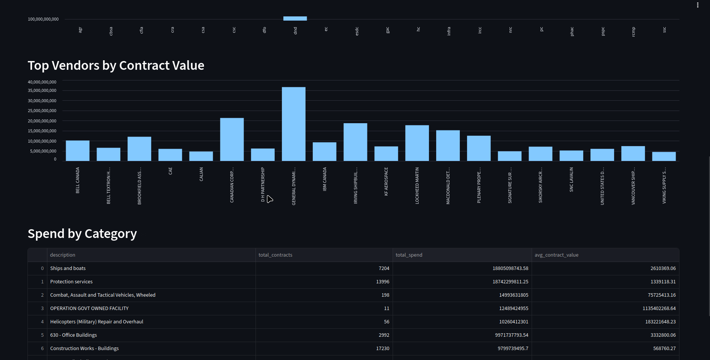

# Canadian Government Contracts — Data Engineering Pipeline

An end-to-end data engineering project that ingests, transforms, and visualizes Canadian government contract data using industry-standard tools.

---

## Architecture

```
GCS (Raw Zone)
     │
     ▼
Airflow DAG 1 — first_dag_DEZ
  ├── Fetch data from GCS bucket
  ├── Extract schema & create BigQuery tables
  └── Load data to BigQuery staging
     │
     ▼
Airflow DAG 2 — dbt_check_dag  (runs inside Docker)
  ├── dbt run  → staging models (views)
  └── dbt test → data quality checks
     │
     ▼
Airflow DAG 3 — aggregate_data_dag  (runs inside Docker)
  ├── dbt run  → mart models (tables)
  └── dbt test → mart quality checks
     │
     ▼
Streamlit Dashboard
  └── Visualizes mart tables from BigQuery
```

---

## Tech Stack

| Layer | Tool |
|---|---|
| Orchestration | Apache Airflow 2.9 (Dockerized, CeleryExecutor) |
| Transformation | dbt (dbt-bigquery) |
| Data Warehouse | Google BigQuery |
| Storage | Google Cloud Storage |
| Containerization | Docker + Docker Compose |
| Visualization | Streamlit |

---

## Data Models

### Staging (Views)
| Model | Description |
|---|---|
| `stg_raw_data` | Raw source data with metadata |
| `query_1` | Cleaned & filtered contracts (no errors, no nulls) |
| `query_2` | Subset with additional value filters |
| `query_3` | Record count of filtered data |

### Marts (Tables)
| Model | Description |
|---|---|
| `mart_spend_by_department` | Total spend & contracts per government department |
| `mart_top_vendors` | Top vendors ranked by total contract value |
| `mart_spend_over_time` | Yearly spend and contract trends |
| `mart_spend_by_category` | Spend breakdown by contract category |

---

## Project Structure

```
dez_project/
├── dags/
│   ├── CheckDataDAG.py        # Ingestion pipeline
│   ├── DbtDAG.py              # dbt staging models
│   ├── AggregateDataDAG.py    # dbt mart models
│   └── scripts/               # Python helper scripts
├── dbt/
│   ├── models/
│   │   ├── staging/           # Staging views
│   │   └── marts/             # Aggregation tables
│   ├── profiles.yml
│   └── Dockerfile
├── streamlit/
│   └── frontend/
│       └── app.py             # Dashboard
├── docker-compose.yml
└── Dockerfile
```

---

## How to Run

### Prerequisites
- Docker & Docker Compose
- GCP project with BigQuery enabled
- GCS bucket with raw data
- Service account JSON key with BigQuery & GCS permissions

### 1. Clone the repo
```bash
git clone <repo-url>
cd dez_project
```

### 2. Add your service account
```bash
mkdir -p ../secrets
cp /path/to/service-account.json ../secrets/service-account.json
```

### 3. Start Airflow
```bash
export DOCKER_GID=$(stat -c '%g' /var/run/docker.sock)
docker compose up -d
```

### 4. Build the dbt image
```bash
docker compose build dbt
```

### 5. Trigger the pipeline
- Open Airflow UI at `http://<your-vm-ip>:8080`
- Trigger `first_dag_DEZ` — this will automatically chain through all 3 DAGs

### 6. Run the Streamlit dashboard
```bash
cd streamlit/frontend
uv venv .venv && source .venv/bin/activate
uv pip install -r requirements.txt
streamlit run app.py
```

Open `http://<your-vm-ip>:8501`

---

## Airflow DAGs

### DAGs Overview


3 active DAGs orchestrate the full pipeline — `first_dag_DEZ` runs on a daily schedule and automatically triggers the dbt DAGs on success.

### first_dag_DEZ — Ingestion Pipeline


3 tasks built with `PythonOperator`:
- `task1_fetch` — downloads data from GCS
- `task2_schema` — extracts schema and creates BigQuery tables
- `task3_load` — loads data to BigQuery staging

---

## Dashboard



The Streamlit dashboard connects directly to BigQuery and visualizes the aggregated mart tables:

- **Spend by Department** — bar chart showing total contract spend per government department (e.g. DND dominates at ~$100B)
- **Top Vendors by Contract Value** — General Dynamics leads with ~$35B, followed by Canadian Corp and Lockheed Martin
- **Spend by Category** — table breakdown by contract type: Ships & boats ($18.8B), Protection services ($18.7B), Combat vehicles ($15B)

---

## Pipeline DAG Flow

```
first_dag_DEZ → dbt_check_dag → aggregate_data_dag
```

Each DAG is automatically triggered on success of the previous one.
